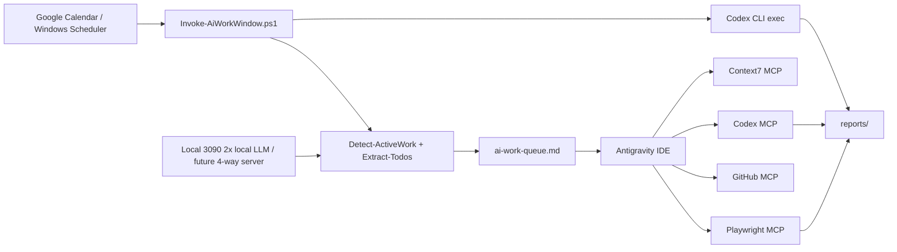

# Integrated Toolchain Plan

This plan binds more than three tools, including LLMs, into one organic workflow.

## Primary Interface Decision

Use **Antigravity IDE as the single primary tool**.

This does not merge quota or tokens across providers. Gemini, Codex, Claude, API keys, and local models still consume their own quotas. The practical goal is different: keep one human-facing control surface, then route work from that surface into the right backend.

```text
Primary surface: Antigravity IDE
Backend workers: Codex MCP, Codex CLI, Gemini CLI/API, Context7, Playwright, GitHub MCP, local LLM servers
Review surface: Antigravity IDE
Usage ledger: provider-specific CSV reports under reports/
```

When exact token accounting matters, route the job through a CLI/API path that exposes usage:

- Codex: `codex exec --json`, parsed by `scripts/Parse-CodexUsage.ps1`
- Gemini API: `countTokens` before execution and response `usageMetadata` after execution
- Antigravity IDE: quota UI or local quota tool for provider quota; transcript estimates only for trends

## Target Architecture



## Tool Roles

| Tool | Role | Best Mode |
| --- | --- | --- |
| Antigravity IDE | Human-facing coding surface, diff review, artifact review | interactive |
| Codex MCP | Deep coding worker called from Antigravity IDE or another MCP client | delegated |
| Codex CLI `exec` | Scheduled or repeatable jobs with fixed sandbox settings | automation |
| Codex subagents | Parallel read-heavy investigation | explicit fan-out |
| Context7 MCP | Current library and API documentation | on-demand |
| Playwright MCP | Browser flow reproduction and UI verification | task-specific |
| GitHub MCP | Issues, PRs, Actions, code security, review context | read-only first |
| Local 3090 2x LLM | Broad preprocessing, logs, repo summaries, embeddings | local batch |
| Future 3090 4-way server | Heavy local inference, larger context preprocessing, batch summarization | remote/local API |

## Operating Loop

1. A scheduled window starts or the user opens Antigravity IDE.
2. `Invoke-AiWorkWindow.ps1` refreshes context:
   - optional Google Calendar check
   - active work report
   - TODO/FIXME report
   - token estimate log
3. The dispatcher reads:
   - `ai-work-queue.md`
   - `reports/current_context.md`
   - `reports/current_todos.md`
   - current quota notes supplied by the user
4. The dispatcher chooses one job:
   - read-only audit
   - docs/API verification
   - UI/browser verification
   - worktree implementation
5. The selected job is sent to the right tool:
   - Antigravity IDE for manual edit/approval.
   - Codex MCP for IDE-delegated code reasoning.
   - Codex CLI for jobs that need exact token accounting.
   - Gemini CLI/API for Gemini quota/API-backed work.
   - Local LLM for broad preprocessing.
6. The job writes a report under `reports/`.
7. The user reviews the artifact in Antigravity IDE.

## Routing Rules

| Signal | Route |
| --- | --- |
| Needs current docs | Antigravity IDE + Context7 MCP |
| Needs implementation | Antigravity IDE + Codex MCP, write only after plan review |
| Needs exact token accounting | Antigravity IDE dispatch + Codex CLI `exec --json` |
| Needs scheduled report | Windows Scheduler + Codex CLI `exec` or Gemini CLI/API |
| Needs broad repo scan | Local LLM first, then Codex for ranked reasoning |
| Needs UI proof | Playwright MCP, then Codex or Antigravity for fix plan |
| Needs PR/issue state | GitHub MCP read-only toolsets first |
| Needs many parallel opinions | Codex subagents in read-only sandbox |

## Quota-Aware Policy

Do not spend quota just because quota exists. Maintain a queue of useful work, then pick jobs that match the remaining 5h window.

```text
if current_window_remaining is low:
  run read-only summarization or docs checks
elif weekly_remaining is high:
  run B-grade audits and test planning
elif urgent bug exists:
  reserve quota for interactive Antigravity IDE + Codex MCP
else:
  run local LLM preprocessing and defer Codex
```

## Recommended Four-Tool Default

Start with this minimal reliable set:

1. Antigravity IDE
2. Codex MCP
3. Context7 MCP
4. Codex CLI `exec`

Enable Playwright only for UI work, GitHub MCP only when PR/issues are in scope, and local vLLM/Ollama only after the model server is confirmed.

## GPU Topology

Current PC:

- GPU 0: RTX 3090, primary gaming/display workload.
- GPU 1: RTX 3090, local LLM workload.

Planned separate server:

- 4-way RTX 3090 server for heavier local inference and batch preprocessing.
- Expose it through one API endpoint, ideally OpenAI-compatible via vLLM, LM Studio, or another router.
- Antigravity IDE should call the server through MCP or a small local gateway, not by manually switching terminals.

Recommended local model role:

```text
Local 2nd 3090: fast summaries, issue clustering, log compression, candidate task generation.
Future 4-way server: larger local models, bigger repo analysis, batch test generation drafts.
Cloud frontier models: final architecture, hard debugging, high-risk implementation.
```

## Source Notes

- Antigravity projects can scope folders, permissions, and MCP tools per project.
- Antigravity supports local and remote MCP servers, configured through `$HOME/.gemini/config/mcp_config.json`.
- Codex can run as an MCP server exposing `codex` and `codex-reply`.
- Codex `exec` is intended for scheduled jobs, pipelines, and CLI workflows with explicit sandbox settings.
- Codex subagents are explicit, inherit sandbox controls, and work well for parallel review.
- Playwright MCP gives LLMs browser automation through structured accessibility snapshots.
- Context7 fetches current code documentation into the LLM context.
- vLLM supports multi-GPU serving with tensor parallelism, which fits a 4-way 3090 local preprocessing server.

## Primary References

- Antigravity project permissions, MCP configuration, scheduling, and artifacts: https://codelabs.developers.google.com/getting-started-google-antigravity
- MCP overview: https://modelcontextprotocol.io/docs/getting-started/intro
- Codex MCP server and multi-agent workflow: https://developers.openai.com/codex/guides/agents-sdk
- Codex non-interactive automation: https://developers.openai.com/codex/noninteractive
- Codex MCP configuration: https://developers.openai.com/codex/mcp
- Codex subagents: https://developers.openai.com/codex/subagents
- Playwright MCP: https://playwright.dev/docs/getting-started-mcp
- Context7 MCP: https://github.com/upstash/context7
- GitHub MCP server: https://github.com/github/github-mcp-server
- vLLM parallelism and scaling: https://docs.vllm.ai/en/latest/serving/parallelism_scaling.html
