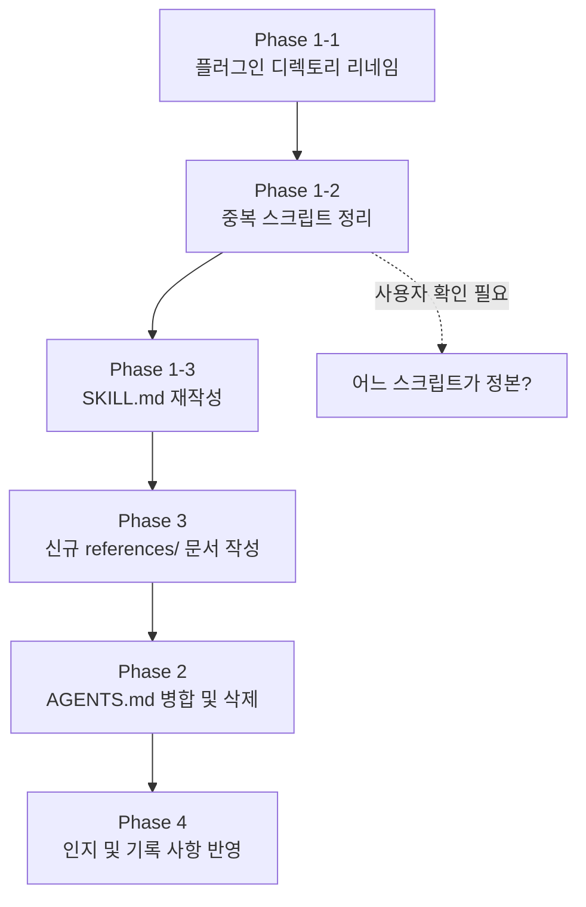

# `/ai-delegation` 스킬 재정의 및 워크스페이스 정리 기획안

## 1. 배경 및 문제 정의

현재 `Intergrated POWER` 워크스페이스의 AI 위임 시스템에는 다음과 같은 **구조적 문제**가 누적되어 있다.

| # | 문제 | 근본 원인 |
|---|---|---|
| ① | `codex-orchestrator`라는 스킬 명칭이 orchestrator 모델로 하여금 Codex에만 위임하도록 유도 | 명칭이 역할을 왜곡 |
| ② | Serena를 통한 코드베이스 인덱싱/중복 기능 방지 메커니즘이 미완성 | 구현 미완 |
| ③ | worker의 출력이 이중화됨 (설명용 `.md` + 실제 파일 수정) | 출력 계약 미정의 |
| ④ | 작업 산출물(`discussions/`, `reports/`, `AgenticLoop_*.md` 등)이 repo를 오염 | brain 경로 미연결 |
| ⑤ | `AGENTS.md`와 `.agents/AGENTS.md`가 중복 존재 | 설정 파일 비통일 |
| ⑥ | 동시 쓰기 방지 메커니즘 부재 | 파일 수준 lock 미구현 |

### 이 기획안의 목적

위 문제들을 해결하기 위한 **세부 계획서**를 작성한다. 이 계획서는 다른 모델(Codex, 로컬 LLM)에게 위임해도 문제 없는 수준의 디테일을 포함한다.

---

## 2. 사용자와 확정된 결정 사항 (인터뷰 결과)

| 결정 항목 | 확정 내용 |
|---|---|
| 스킬 이름 | `codex-orchestrator` → **`ai-delegation`**으로 변경 |
| 스킬 범위 | Codex 전용이 아닌 **범용 위임 라우터** (Codex CLI, Aider, Serena, 로컬 LLM, Main Agent 직접 작업 모두 포괄) |
| 역할 경계 | Codex CLI = bounded 코드 작성/리뷰, Aider = 로컬 Ollama 기반 파일 직접 수정, Serena = 코드베이스 인덱싱/요약/심볼 분석(읽기 전용), 로컬 LLM 직접 = 단순 텍스트 전처리/포매팅/번역 |
| 출력 방식 | Worker는 **대상 파일을 직접 수정** + **1줄 요약 + 변경 파일 경로 목록**만 반환. 설명용 `.md` 생성 금지 |
| 동시 쓰기 방지 | `.lock` 파일 방식. lock 감지 시 **명시적 에러** 반환 (추론 금지) |
| 산출물 저장 위치 | 모든 산출물은 **brain 경로** (`~/.gemini/antigravity-ide/brain/<conversation-id>/`)로 이동. repo 내 생성 금지 |
| AGENTS.md | `.agents/AGENTS.md`만 유지. 루트 `AGENTS.md` 내용을 병합 후 삭제 |
| 참조 문서 구조 | SKILL.md 내 `## References` 섹션 + `references/<topic>.md` 연결 |
| 이식성 | 이번 작업에서는 **인지 및 기록만**. 실제 구현은 추후 |
| repo 정리 | 이번 작업에서는 **계획서에 기록만**. 실제 삭제는 추후 |
| 확장 프로그램 hook | `dashboard-state.json`의 `delegationStatus` 블록 업데이트 → FileSystemWatcher로 UI 반영 (인지 및 기록, 추후 구현) |

---

## 3. 명칭 정의표

> [!IMPORTANT]
> 이 프로젝트에서 사용되는 도구/플랫폼 명칭은 반드시 아래 표를 따른다. 오독 금지.

| 명칭 | 설명 | 기반 모델 |
|---|---|---|
| **Codex** (GUI) | ChatGPT를 사용할 수 있는 GUI 도구 | GPT |
| **Codex CLI** | Codex를 CLI로 호출하는 기능. 현재 위임 구현에 사용 중 | GPT |
| **Antigravity** (GUI) | Gemini를 사용할 수 있는 GUI 도구 | Gemini |
| **Antigravity IDE** | Gemini를 사용할 수 있는 VS Code 포크 버전 (현재 IDE) | Gemini |
| **agy** | Gemini를 사용할 수 있는 CLI 버전 | Gemini |
| **Aider** | 로컬 Ollama 기반 파일 직접 수정 도구 | 로컬 LLM |
| **Serena** | 코드베이스 인덱싱/요약/심볼 분석 (읽기 전용) | 로컬 LLM |
| **로컬 LLM 직접** | Ollama/vLLM을 직접 호출하여 단순 텍스트 작업 | 로컬 LLM |

---

## 4. Proposed Changes

### Phase 1: 스킬 재정의 (`codex-orchestrator` → `ai-delegation`)

> [!IMPORTANT]
> 플러그인 디렉토리와 스킬 디렉토리의 이름 변경이 필요합니다. Antigravity IDE가 스킬을 자동 발견하는 방식에 영향을 줄 수 있으므로 주의가 필요합니다.

#### Phase 1-1: 플러그인 디렉토리 리네임

**변경 전 경로:**
```
C:\Users\jsp0\.gemini\config\plugins\codex-orchestrator-plugin\
├── README.md
├── plugin.json
├── install\
│   └── Install-Plugin.ps1
└── skills\
    └── codex-orchestrator\
        ├── SKILL.md
        ├── references\
        │   ├── ai_routing_policy.json
        │   ├── debate.md
        │   ├── job.md
        │   ├── local-llm.md
        │   ├── local_llm_model_registry.csv
        │   ├── routing.md
        │   └── workwindow.md
        └── scripts\
            ├── Ensure-CodexOrchestratorSetup.ps1
            ├── Invoke-AiWorkWindow.ps1
            ├── Invoke-CodexDebate.ps1
            ├── Invoke-CodexJob.ps1
            ├── Invoke-LocalLLM.ps1
            ├── Invoke-vLLMJob.ps1
            ├── Select-LocalLLMModel.ps1
            └── Update-LocalLLMMetric.ps1
```

**변경 후 경로:**
```
C:\Users\jsp0\.gemini\config\plugins\ai-delegation-plugin\
├── README.md
├── plugin.json
├── install\
│   └── Install-Plugin.ps1
└── skills\
    └── ai-delegation\
        ├── SKILL.md
        ├── references\
        │   ├── ai_routing_policy.json
        │   ├── codex-cli.md          ← debate.md + job.md 통합
        │   ├── aider.md              ← 신규
        │   ├── serena.md             ← 신규
        │   ├── local-llm.md          ← 기존 유지
        │   ├── local_llm_model_registry.csv  ← 기존 유지
        │   ├── routing.md            ← 기존 수정
        │   ├── workwindow.md         ← 기존 유지
        │   ├── naming-conventions.md ← 신규 (명칭 정의표)
        │   ├── file-lock-protocol.md ← 신규 (동시 쓰기 방지)
        │   └── portability-notes.md  ← 신규 (이식성 검토 기록)
        └── scripts\
            ├── Ensure-AiDelegationSetup.ps1  ← 리네임
            ├── Invoke-AiWorkWindow.ps1
            ├── Invoke-CodexDebate.ps1
            ├── Invoke-CodexJob.ps1
            ├── Invoke-LocalLLM.ps1
            ├── Invoke-vLLMJob.ps1
            ├── Select-LocalLLMModel.ps1
            └── Update-LocalLLMMetric.ps1
```

##### 주의사항: import/참조 변경 목록

| 파일 | 변경 내용 |
|---|---|
| [plugin.json](file:///C:/Users/jsp0/.gemini/config/plugins/codex-orchestrator-plugin/plugin.json) | `name`: `"codex-orchestrator-plugin"` → `"ai-delegation-plugin"`, `description` 수정 |
| [SKILL.md](file:///C:/Users/jsp0/.gemini/config/plugins/codex-orchestrator-plugin/skills/codex-orchestrator/SKILL.md) | YAML frontmatter `name`/`description` 변경, 본문 전체 수정 |
| [Install-Plugin.ps1](file:///C:/Users/jsp0/.gemini/config/plugins/codex-orchestrator-plugin/install/Install-Plugin.ps1) | 내부에서 `codex-orchestrator` 경로를 참조하는 부분 확인 후 수정 |
| [Ensure-CodexOrchestratorSetup.ps1](file:///C:/Users/jsp0/.gemini/config/plugins/codex-orchestrator-plugin/skills/codex-orchestrator/scripts/Ensure-CodexOrchestratorSetup.ps1) | 파일명 → `Ensure-AiDelegationSetup.ps1`, 내부 참조 수정 |
| [routing.md](file:///C:/Users/jsp0/.gemini/config/plugins/codex-orchestrator-plugin/skills/codex-orchestrator/references/routing.md) | Codex 편향 제거, 4가지 역할 경계 반영 |
| 글로벌 `gemini.md` (사용자 규칙) | `codex-orchestrator`를 참조하는 모든 부분 → `ai-delegation`으로 변경 |
| `.agents/AGENTS.md` | `codex-orchestrator` → `ai-delegation` 참조 변경 |
| repo 내 `scripts/dispatch/` ps1 파일들 | 스킬 스크립트와 repo 스크립트가 중복되는 부분 정리 (아래 Phase 1-2에서 상세) |

#### Phase 1-2: 스킬 스크립트와 repo 스크립트 중복 해소

**현재 문제**: 플러그인의 `skills/ai-delegation/scripts/` 안에도 스크립트가 있고, repo의 `scripts/dispatch/`에도 유사한 스크립트가 있다.

##### 조사 결과 (2026-07-08 확인)

플러그인 6개 파일은 **모두 동일 시각(7/4 02:31)**에 기록됨 → `Install-Plugin.ps1`이 일괄 복사한 **스냅샷**으로 판정.

| 스크립트 | 플러그인 (수정일 / 크기) | repo (수정일 / 크기) | 정본 | 판정 근거 |
|---|---|---|---|---|
| `Invoke-CodexDebate.ps1` | 7/4 02:31 / 31KB (929줄) | 7/3 19:03 / 6.6KB (173줄) | **플러그인** | 플러그인이 풀 기능 버전 (`ContextFile`, `DiscussionRoot`, `MaxHistoryChars`, `DryRun`, `SelfTest` 파라미터 포함). repo는 간소화 복사본 |
| `Invoke-CodexJob.ps1` | 7/4 02:31 / 5.5KB | 7/4 01:02 / 3.9KB | **플러그인** (추정) | 같은 패턴 (플러그인이 더 큼, 스냅샷이 최후 통합 시점) |
| `Invoke-AiWorkWindow.ps1` | 7/4 02:31 / 4.1KB | 7/4 00:55 / 3.5KB | **플러그인** (추정) | 같은 패턴 |
| `Invoke-LocalLLM.ps1` | 7/4 02:31 / 11.7KB | **7/4 21:59** / 14.7KB | **repo** | repo가 스냅샷 이후 19.5시간 뒤에 추가 개발됨, 크기도 3KB 증가 |
| `Invoke-vLLMJob.ps1` | 7/4 02:31 / 14.3KB | **7/4 21:05** / 17.2KB | **repo** | repo가 스냅샷 이후 18.5시간 뒤에 추가 개발됨, 크기도 2.9KB 증가 |
| `Select-LocalLLMModel.ps1` | 7/4 02:31 / 7.9KB | **7/4 22:57** / 12.8KB | **repo** | repo가 스냅샷 이후 20.5시간 뒤에 추가 개발됨, 크기도 4.9KB 증가 |

repo 전용 스크립트 (플러그인에 대응 파일 없음):

| repo 전용 스크립트 | 크기 | 비고 |
|---|---|---|
| `Invoke-AgenticLoop.ps1` | 33KB | 워크스페이스 전용 실행 루프 |
| `Invoke-AiderWorker.ps1` | 9.2KB | Aider 연동 wrapper |
| `Invoke-DelegatedAgentTask.ps1` | 16KB | 범용 위임 진입점 |
| `Invoke-SerenaBackgroundJob.ps1` | 23KB | Serena 백그라운드 인덱싱 |
| `Export-PowerShellSymbols.ps1` | 8KB | 심볼 내보내기 |
| `Export-SerenaSymbols.py` | 4.1KB | Serena 심볼 내보내기 (Python) |
| `New-ContextManifest.ps1` | 1.7KB | 컨텍스트 매니페스트 생성 |
| `Select-AgenticDelegationMode.ps1` | 7KB | 위임 모드 선택 |
| `Select-AgenticValidator.ps1` | 9.4KB | 검증기 선택 |
| `Test-SerenaCapability.ps1` | 5.5KB | Serena 기능 테스트 |

##### 확정된 조치 방안

| 스크립트 | 조치 |
|---|---|
| `Invoke-CodexDebate.ps1` | 플러그인 버전을 정본으로 채택. repo 버전을 플러그인 버전으로 **교체** |
| `Invoke-CodexJob.ps1` | 플러그인 버전을 정본으로 채택. repo 버전을 플러그인 버전으로 **교체** |
| `Invoke-AiWorkWindow.ps1` | 플러그인 버전을 정본으로 채택. repo 버전을 플러그인 버전으로 **교체** |
| `Invoke-LocalLLM.ps1` | repo 버전을 정본으로 채택. 플러그인 버전을 repo 버전으로 **교체** |
| `Invoke-vLLMJob.ps1` | repo 버전을 정본으로 채택. 플러그인 버전을 repo 버전으로 **교체** |
| `Select-LocalLLMModel.ps1` | repo 버전을 정본으로 채택. 플러그인 버전을 repo 버전으로 **교체** |
| repo 전용 10개 | 플러그인에 복사 **하지 않음**. repo에만 유지 (워크스페이스 전용) |

**원칙:**
- **플러그인**에는 이식 시 함께 가야 하는 핵심 스크립트만 포함 (Codex CLI 호출, 로컬 LLM 호출 등 범용 기능)
- **repo**에는 워크스페이스 전용 커스텀/확장 스크립트를 배치 (AgenticLoop, Aider, Serena, DelegatedTask 등)
- 정본 동기화: `Install-Plugin.ps1`이 설치 시 최신본을 양방향으로 동기화하도록 수정 (추후 구현)

---

#### Phase 1-3: SKILL.md 재작성

**새 SKILL.md의 구조 (초안):**

```markdown
---
name: ai-delegation
description: >
  범용 AI 작업 위임 라우터. 작업 성격에 따라 Main Agent 직접 작업,
  Codex CLI 위임, Aider(로컬 파일 수정), Serena(코드베이스 분석),
  로컬 LLM 전처리 중 최적 경로를 선택한다.
  트리거: "위임", "delegate", "Codex", "로컬 LLM", "Aider",
  "Serena", "코드 분석", "token-efficient" 등.
---

# AI Delegation Router

## 역할 경계 (Role Boundaries)
(4가지 역할의 명확한 정의 — 명칭 정의표 참조)

## 라우팅 분류 (Mode Classification)
0. Routing Decision → `references/routing.md`
1. Codex CLI Mode → `references/codex-cli.md`
2. Aider Mode → `references/aider.md`
3. Serena Mode → `references/serena.md`
4. Local LLM Mode → `references/local-llm.md`
5. WorkWindow Mode → `references/workwindow.md`

## 출력 계약 (Output Contract)
- Worker는 대상 파일을 직접 수정한다
- 완료 후 1줄 요약 + 변경 파일 경로 목록만 반환
- 설명용 .md 파일 생성 금지

## 동시 쓰기 방지 → `references/file-lock-protocol.md`

## 명칭 정의 → `references/naming-conventions.md`

## 이식성 검토 (추후) → `references/portability-notes.md`

## References
- [routing.md](references/routing.md)
- [codex-cli.md](references/codex-cli.md)
- [aider.md](references/aider.md)
- [serena.md](references/serena.md)
- [local-llm.md](references/local-llm.md)
- [workwindow.md](references/workwindow.md)
- [file-lock-protocol.md](references/file-lock-protocol.md)
- [naming-conventions.md](references/naming-conventions.md)
- [portability-notes.md](references/portability-notes.md)
```

---

### Phase 2: `.agents/AGENTS.md` 병합 및 루트 `AGENTS.md` 삭제

#### [MODIFY] [AGENTS.md](file:///c:/Users/jsp0/Documents/Intergrated%20POWER/.agents/AGENTS.md)

**병합 내용:**
- 루트 `AGENTS.md`의 1~36 라인 (Operating Principles, Verification Expectations, AI Communication & Skill Priority) 중 `.agents/AGENTS.md`에 없는 내용을 병합
- 모든 `codex-orchestrator` 참조 → `ai-delegation`으로 변경
- `codex-transparent-debate` → `ai-delegation`의 Codex CLI Debate 모드로 참조 경로 변경
- 인터뷰에서 확정된 **인지 및 기록 사항**을 별도 섹션으로 추가:
  - 이식성 검토 사항 (Mac, Linux, Android, iPhone, Cursor, VSC, Claude Code, agy 등)
  - 확장 프로그램 hook 구현 계획 (dashboard-state.json delegationStatus)
  - Serena 백그라운드 모드 + git diff 기반 재인덱싱 설계 방향
  - 중복 기능 방지 관제 수단 필요성

#### [DELETE] [AGENTS.md](file:///c:/Users/jsp0/Documents/Intergrated%20POWER/AGENTS.md) (루트)

병합 완료 후 삭제.

---

### Phase 3: 신규 참조 문서 작성 (references/)

#### [NEW] `references/codex-cli.md`
- 기존 `debate.md`와 `job.md`를 통합
- Codex CLI 호출 방식, 샌드박스 권한, 완료 시그널(`CODEX_JOB_DONE`), 타이머 가이드
- Debate Mode / Job Mode 섹션 구분

#### [NEW] `references/aider.md`
- Aider의 역할: 로컬 Ollama 기반 파일 직접 수정
- 호출 방식: `Invoke-AiderWorker.ps1` 또는 `Invoke-DelegatedAgentTask.ps1 -WorkerBackend Aider`
- 출력 계약: 파일 직접 수정 + 요약 반환
- backup/validation/rollback 흐름

#### [NEW] `references/serena.md`
- Serena의 역할: 코드베이스 인덱싱/요약/심볼 분석 (읽기 전용)
- 현재 구현 상태:
  - [Invoke-SerenaBackgroundJob.ps1](file:///c:/Users/jsp0/Documents/Intergrated%20POWER/scripts/dispatch/Invoke-SerenaBackgroundJob.ps1) 존재 (586줄, 23KB)
  - [project.yml](file:///c:/Users/jsp0/Documents/Intergrated%20POWER/.serena/project.yml) 설정 존재 (language: typescript)
  - `.serena/cache/`, `.serena/logs/`, `.serena/memories/` 디렉토리 존재
- 미완성 사항:
  - 로컬 LLM과의 연동 완성도 불명
  - 백그라운드 주기적 인덱싱 vs 변경 감지(git diff) 기반 재인덱싱 결정 미확정
  - GPU 경합 시 우아한 종료(graceful shutdown) 구현 필요
- 중복 기능 방지 활용 방안 (인지 및 기록):
  - 위임 전 Serena 인덱스 조회로 "이미 이 기능이 있는지" 자동 체크
  - 머메이드 차트를 통한 시각화 가능성

#### [NEW] `references/file-lock-protocol.md`
- `.lock` 파일 규격:
  - 위치: 대상 파일과 같은 디렉토리에 `<filename>.lock` 생성
  - 내용: `{ "worker": "codex-cli", "pid": 12345, "started": "2026-07-08T09:30:00Z" }`
  - 수명: worker 완료 또는 crash 시 삭제
- lock 감지 시 행동 규칙:
  1. worker가 `.lock` 파일을 발견하면 **추론하지 않고 즉시 에러 반환**
  2. 에러 메시지: `"FILE_LOCKED: <filename> is being modified by <worker>. Retry after the lock is released, or queue this task."`
  3. lock된 파일에 의존하는 작업은 큐에 넣고 대기
  4. lock이 TTL(기본 30분)을 초과하면 stale로 판정, 강제 해제 후 경고 반환
- lock 라이프사이클 다이어그램

#### [NEW] `references/naming-conventions.md`
- 위 명칭 정의표를 그대로 포함
- 모델이 오독하지 않도록 명시

#### [NEW] `references/portability-notes.md`
- 현재 모든 스크립트가 PowerShell(.ps1)로 구현됨
- 이식 가능성 검토 대상 목록 (인지 및 기록):
  - **다른 IDE/도구**: Cursor, VSC (내장 모델 없음 — 확장 프로그램으로 대체?), agy (CLI), Claude Code, Antigravity (GUI), Codex (GUI)
  - **다른 OS**: Mac, Linux, Android, iPhone
  - **이식 전략**: PowerShell Core (크로스 플랫폼) 또는 Node.js/Python 포팅
- 확장 프로그램 설치 시 스킬 등록 및 내장 파일 검증 방법

---

### Phase 4: 글로벌 규칙 파일 정리 (인지 및 기록)

> [!NOTE]
> 아래 항목들은 이번 작업에서 **실행하지 않고 기록만** 합니다.

#### repo 정리 대상 (추후 실행)
| 대상 | 조치 | 이유 |
|---|---|---|
| `AgenticLoop_*.md` 7개 | brain 경로로 이동 또는 삭제 | repo 오염 |
| `discussions/` | brain 경로로 이동 또는 삭제 | 대화 산출물 |
| `reports/` | brain 경로로 이동 | 실행 리포트 |
| `operational-data/` | brain 경로로 이동 | 운영 데이터 |
| `prompts/` | 필요성 검토 후 결정 | 용도 불명 |
| `tests/` | 유지 (테스트 코드) | 코드베이스 일부 |
| `docs/` | 유지 (문서) | 코드베이스 일부 |

#### 확장 프로그램 hook 구현 (추후)
- `dashboard-state.json`에 `delegationStatus` 블록 추가
- ps1 스크립트가 위임 시작/완료 시 이 블록을 업데이트
- 확장 프로그램이 `FileSystemWatcher`로 변경 감지 → webview UI 즉시 반영
- 표시할 정보: worker 종류, 대상 파일, VRAM 로드 상태, 토큰 소모량 변화

#### Serena 하이브리드 모드 설계 (추후)
- 기본: **변경 감지(git diff) 기반** — 파일이 변경될 때 해당 파일의 심볼만 재인덱싱
- 보조: **사용자 요청 시** 전체 인덱스 스캔
- GPU 경합 대응: GPU 사용률이 높으면 Serena를 graceful shutdown (인덱스는 캐시에 보존)
- 자동 git add/commit: 사용자 습관 보완을 위한 자동화 (인지만)

#### 중복 기능 관제 (추후)
- Serena 인덱스를 기반으로 "이미 존재하는 기능 목록"을 자동 조회
- 위임 전 자동 체크: "이 기능과 유사한 심볼이 이미 존재합니다"
- 머메이드 차트 시각화: 사용자 요청 시 코드 구조를 차트로 표시

---

## 5. 실행 순서 및 의존성



> [!IMPORTANT]
> Phase 1-2에서 **6개 중복 스크립트의 정본 확인**이 필요합니다. 이 결정 없이는 스킬 재정의를 안전하게 완료할 수 없습니다.

---

## 6. Verification Plan

### 자동 검증
- 리네임 후 Antigravity IDE가 `ai-delegation` 스킬을 정상 인식하는지 확인
  - 스킬 목록에 `ai-delegation`이 표시되는지
  - 기존 `codex-orchestrator`가 더 이상 표시되지 않는지
- `.agents/AGENTS.md`만 인식되고 루트 `AGENTS.md`가 없는지 확인
- `references/` 내 모든 `.md` 파일이 SKILL.md에서 정상 링크되는지

### 수동 검증 (사용자)
- 새 대화를 열었을 때 스킬 설명에 "codex"만 언급되지 않고 범용 라우터로 인식되는지
- "위임해줘", "delegate this" 등 트리거가 정상 작동하는지

---

## Open Questions

> [!NOTE]
> **~~중복 스크립트 정본 확인~~ (해결됨)**: 조사 완료. Codex 계열 3개는 플러그인이 정본, 로컬 LLM 계열 3개는 repo가 정본. 플러그인 6개 파일은 `Install-Plugin.ps1`의 일괄 스냅샷(7/4 02:31)이었음. 상세 조치 방안은 Phase 1-2에 기록됨.

현재 미해결 Open Question 없음. 승인 시 즉시 실행 가능.
